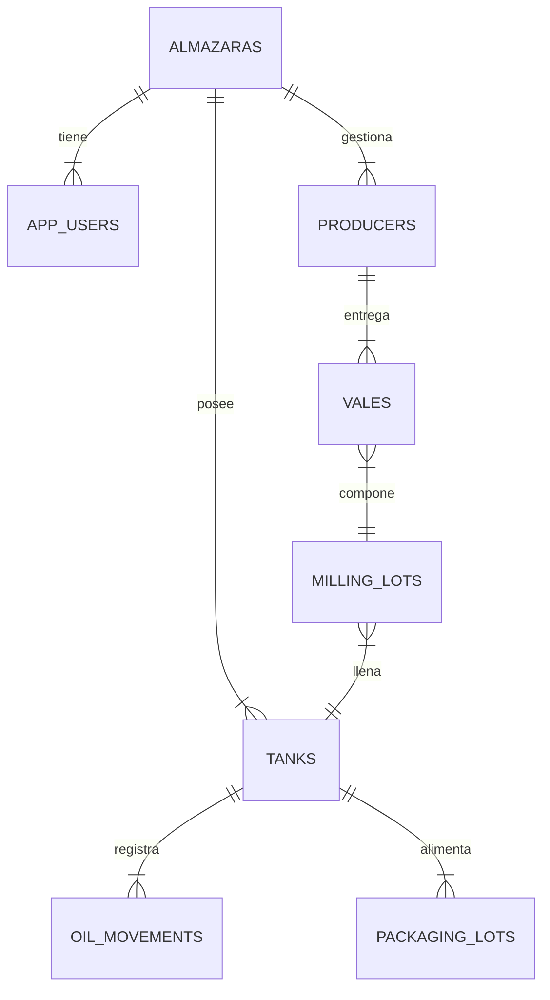

# Esquema de Base de Datos (Supabase / PostgreSQL)

## 1. Principios de Diseño
*   **Multi-tenancy:** Todas las tablas críticas tienen una columna `almazara_id` (UUID) que actúa como partición lógica.
*   **Row Level Security (RLS):** Políticas de seguridad activas para asegurar que los usuarios solo accedan a las filas donde `almazara_id` coincide con su perfil.
*   **UUIDs:** Uso extensivo de UUIDs para claves primarias para evitar colisiones en entornos distribuidos.

## 2. Diagrama Entidad-Relación (Simplificado)



## 3. Definición de Tablas

### 3.1. Gestión de Tenants (`almazaras`)
Tabla maestra de clientes SaaS.
*   `id` (UUID, PK): Identificador único.
*   `cif` (Text, Unique): Identificador fiscal.
*   `subscription_status`: Estado del pago (ACTIVE, SUSPENDED).
*   `config_json`: Configuración específica (JSONB) para personalización.

### 3.2. Usuarios (`app_users`)
Extensión de la tabla `auth.users` de Supabase.
*   `id` (UUID, PK, FK -> auth.users): Vinculación con autenticación.
*   `almazara_id` (UUID, FK): Tenant al que pertenece.
*   `role`: Rol del usuario (ADMIN, OPERATOR, VIEWER).

### 3.3. Productores (`producers`)
Socios o agricultores que entregan aceituna.
*   `id` (UUID, PK)
*   `almazara_id` (UUID, FK)
*   `nif` (Text): Documento identidad.
*   `name` (Text): Nombre o Razón Social.

### 3.4. Vales de Entrada (`vales`)
El documento core de la recepción.
*   `id` (UUID, PK)
*   `sequential_id` (Int): Número visible (1, 2, 3...) generado por trigger por tenant.
*   `producer_id` (UUID, FK)
*   `weight_kg` (Numeric): Peso neto.
*   `type`: 'MOLTURACION' o 'VENTA_DIRECTA'.
*   `milling_lot_id` (UUID, FK, Nullable): Lote de molturación al que se asignó.

### 3.5. Lotes de Molturación (`milling_lots`)
Resultado del proceso industrial.
*   `id` (Text, PK): Identificador formato "MT-YYYY-XXX".
*   `almazara_id` (UUID, FK)
*   `total_olives_kg`: Suma de los vales.
*   `industrial_oil_kg`: Aceite real obtenido.
*   `deposito_id` (Int): Tanque destino.

### 3.6. Depósitos (`tanks`)
Estado actual de la bodega.
*   `id` (Int): Número físico del depósito (1, 2, 3...).
*   `almazara_id` (UUID, FK): PK Compuesta (id, almazara_id).
*   `current_kg`: Cantidad actual.
*   `variety_id`: Variedad predominante.
*   `status`: 'FILLING', 'FULL'.

### 3.7. Movimientos (`oil_movements`)
Tabla de hechos para trazabilidad.
*   `id` (UUID, PK)
*   `source_tank_id` (Int)
*   `target_tank_id` (Int)
*   `kg` (Numeric)
*   `batch_id` (Text): Identificador de traza generado.

## 4. Políticas de Seguridad (RLS)

Ejemplo de política estándar aplicada a todas las tablas:

```sql
CREATE POLICY "Tenant Isolation" ON table_name
    USING (almazara_id = (SELECT almazara_id FROM app_users WHERE id = auth.uid()))
    WITH CHECK (almazara_id = (SELECT almazara_id FROM app_users WHERE id = auth.uid()));
```

## 5. Triggers Importantes
*   **`set_vale_sequence`**: Se ejecuta `BEFORE INSERT` en la tabla `vales`. Calcula el siguiente `sequential_id` (`MAX(id) + 1`) filtrando por `almazara_id`, asegurando numeración consecutiva sin huecos para cada cliente, independientemente de los demás.
